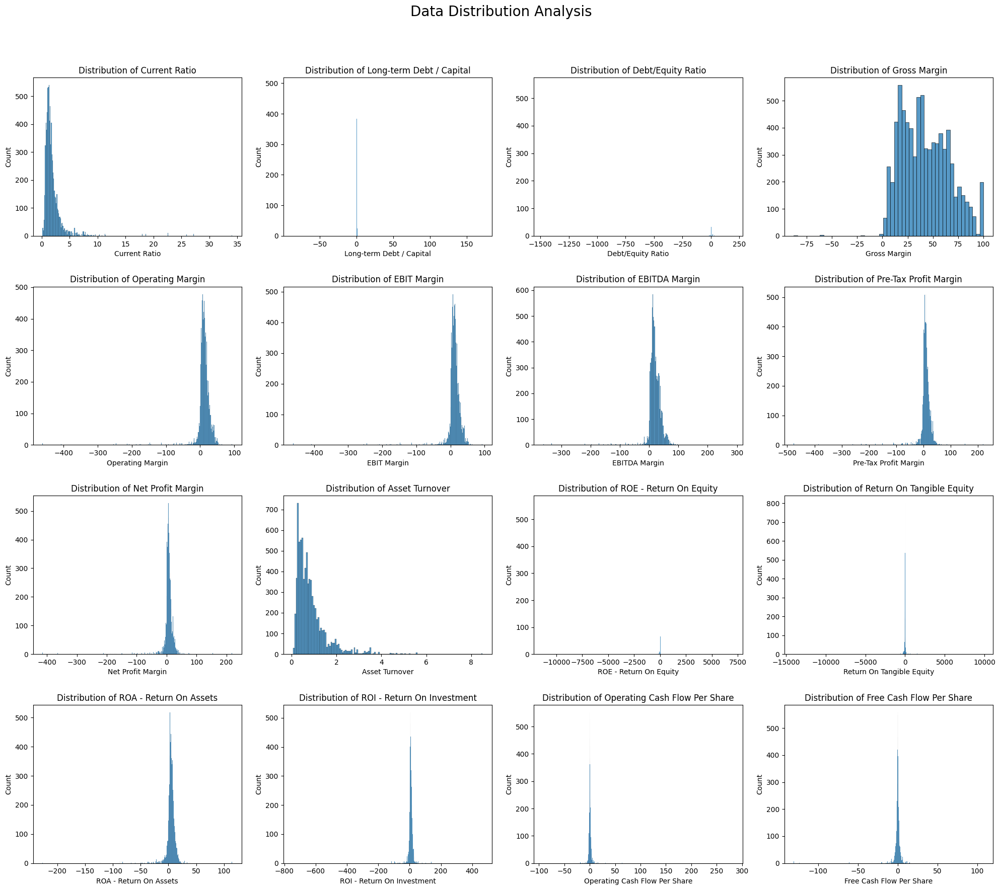
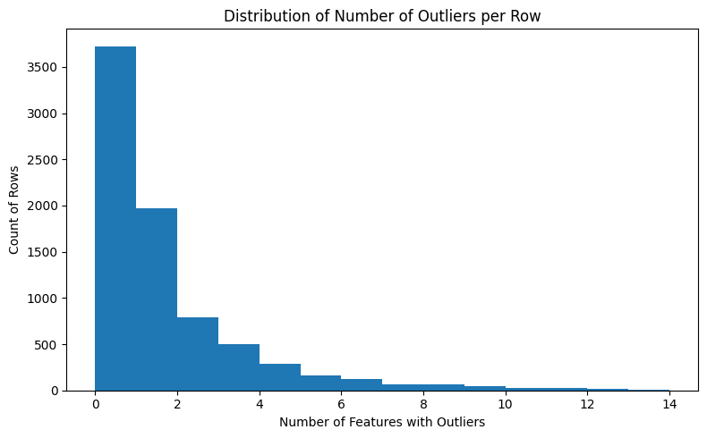

# Predicting Corporate Credit Ratings Using Machine Learning

Author: **Nagendra Rao Donkina**  
UC Berkeley Executive Education    
Professional Certificate in Machine Learning and Artificial Intelligence    
GitHub: https://github.com/master-coder-1

## Table of Contents

1. [Problem Statement](#1-problem-statement)
    - [Background](#background)
    - [Goals](#goals)
    - [Expected Benefits](#expected-benefits)
    - [Findings](#findings)

2. [Model Outcomes and Predictions](#2-model-outcomes-and-predictions)
    - [Learning Type](#learning-type)
    - [Model Output](#model-output)

3. [Data Acquisition](#3-data-acquisition)
    - [Data Sources](#data-sources)
    - [Data Overview](#data-overview)

4. [Data Preprocessing/Preparation](#4-data-preprocessingpreparation)
    - [Data Quality Assessment](#data-quality-assessment)
    - [Data Cleaning](#data-cleaning)
    - [Data Encoding](#data-encoding)
    - [Data Split](#data-split)

5. [Modeling](#5-modeling)
    - [Algorithm Selection](#algorithm-selection)
    - [Models Implemented](#models-implemented)
    - [Implementation Details](#implementation-details)

6. [Model Evaluation](#6-model-evaluation)
    - [Evaluation Metrics](#evaluation-metrics)
    - [Model Performance Comparison - Basic models](#model-performance-comparison---basic-models)
    - [Model Performance Comparison - After HyperParameter Tuning](#model-performance-comparison---after-hyperparameter-tuning)
    - [Feature Importance Analysis](#feature-importance-analysis)

7. [Conclusions](#7-conclusions)
    - [Key Findings](#key-findings)
    - [Limitations](#limitations)
    - [Future Work](#future-work)

8. [References](#8-references)

9. [Appendix](#9-appendix)
    - [Outline of project](#outline-of-project)

## 1. Problem Statement
This project develops and compares machine learning models to predict corporate credit ratings using financial ratios. The analysis employs different classifiers (KNN, Logistic Regression, Decision Tree, SVM, Random Forest and Gradient Boosting ) and identifies the most influential financial indicators for credit rating prediction. Through hyperparameter tuning and feature importance analysis, we provide insights into the key factors that determine a company's credit rating.

### Background
Credit ratings play a crucial role in financial markets by providing an independent assessment of a company's creditworthiness. These ratings significantly influence:
- Borrowing costs for companies
- Investment decisions by institutional investors
- Regulatory compliance and capital requirements
- Market perception and stock valuation

### Goals
The main objectives of this project are to identify
1. Which machine learning model best predicts corporate credit ratings using financial ratios?
2. What are the most important financial indicators that influence credit ratings?

### Expected Benefits
- More efficient credit risk assessment
- Data-driven insights for financial decision-making
- Objective and consistent rating predictions
- Early warning system for potential rating changes

### Findings
The **Random Forest classifier** emerged as the superior model with test accuracy of 78.28% and achieved a strong performance across different risk categories. For more details please refer [Key Findings](#key-findings) section under [Conclusions](#7-conclusions)

## 2. Model Outcomes and Predictions

### Learning Type
- **Type**: Classification (Multi-class)
- **Approach**: Supervised Learning
- **Target Variable**: Credit Rating (Grouped into risk categories)

### Model Output
The model predicts credit risk categories:
1. Lowest Risk (AAA)
2. Low Risk (AA+, AA, AA-, A+, A, A-)
3. Medium Risk (BBB+, BBB, BBB-)
4. High Risk (BB+, BB, BB-, B+, B, B-)
5. Highest Risk (CCC+, CCC, CCC-, CC+, CC, C)
6. Default (D)

## 3. Data Acquisition

### Data Sources
Dataset: [Corporate Credit Rating with Financial Ratios](https://www.kaggle.com/datasets/kirtandelwadia/corporate-credit-rating-with-financial-ratios/data)
- Source: Kaggle dataset
- Size: 7,805 observations with 25 features
- Features: Financial ratios and credit ratings from major rating agencies. 
- Citation: Makwana, R., Bhatt, D., Delwadia, K. et al. Understanding and Attaining an Investment Grade Rating in the Age of Explainable AI. Comput Econ 66, 105–126 (2025). https://doi.org/10.1007/s10614-024-10700-7

### Data Overview
1. **Financial Ratios** (16 features):
   - Profitability: Operating Margin, EBIT Margin, Net Profit Margin
   - Leverage: Debt/Equity, Long-term Debt/Capital
   - Liquidity: Current Ratio
   - Efficiency: Asset Turnover, ROE, ROA
   - Cash Flow: Operating Cash Flow Per Share, Free Cash Flow Per Share

2. **Metadata** (8 features):
   - Rating Agency
   - Corporation Name
   - Rating Date
   - CIK (SEC identifier)
   - SIC Code
   - Sector
   - Ticker

3. **Target Variable**:
   - Credit Rating (Original: AAA to D)
   - Grouped into 6 risk categories

Please see the [Full Data Description](./predict_credit_rating.ipynb#dataset-features) in main notebook.

## 4. Data Preprocessing/Preparation

### Data Quality Assessment
Initial analysis shows:
- Complete dataset with no missing values
- Uneven distribution across risk categories
- Presence of outliers in financial ratios
- Strong correlations between some features

1. **Missing Data Analysis**
   - Dataset contains 7,805 corporate credit ratings with no missing values

2. **Data Distribution Analysis**
   - Most financial ratios show non-normal distributions with significant skewness
   - Plot below Shows the distribution of financial ratios across the dataset
     

3. **Credit Rating Distribution**
    - The dataset exhibits an uneven distribution across risk categories. However, this may not indicate a data quality issue, as such patterns are common within this domain. Typically, only a small number of companies hold the highest credit ratings or fall into default, while the majority are concentrated in the low and medium-risk category.
         
         | Risk Category                              | Count |
         |--------------------------------------------|-------|
         | Low Risk (A+, A, A-, AA+, AA, AA-)         | 2548  |
         | Medium Risk  (BBB+, BBB, BBB-)             | 2461  |
         | High Risk (BB+, BB, BB-, B+, B, B-)        | 2445  |
         | Highest Risk (CCC+, CCC, CCC-, CC, CC+, C) | 256   |
         | Lowest Risk  (AAA)                         | 90    |
         | Default  (D)                               | 5     |
 
      

4. **Outlier Analysis**
   - Many numerical columns have extreme min and max values, indicating potential outliers.
       
    | Statistic | Current Ratio | Long-term Debt/Capital | Debt/Equity | Gross Margin | Operating Margin | EBIT Margin | EBITDA Margin | Pre-Tax Margin | Net Profit Margin | Asset Turnover | ROE   | ROTE  | ROA   | ROI   | Op. Cash Flow/Share | Free Cash Flow/Share |
    |-----------|---------------|------------------------|-------------|--------------|------------------|-------------|---------------|----------------|-------------------|----------------|-------|-------|-------|-------|---------------------|----------------------|
    | count     | 7,805         | 7,805                  | 7,805       | 7,805        | 7,805            | 7,805       | 7,805         | 7,805          | 7,805             | 7,805          | 7,805 | 7,805 | 7,805 | 7,805 | 7,805               | 7,805                |
    | mean      | 1.89          | 0.41                   | 1.42        | 0.37         | 0.14             | 0.14        | 0.19          | 0.11           | 0.08              | 0.82           | 0.15  | 0.19  | 0.06  | 0.07  | 3.42                | 2.16                 |
    | std       | 1.21          | 0.23                   | 2.14        | 0.19         | 0.11             | 0.11        | 0.12          | 0.09           | 0.07              | 0.58           | 0.19  | 0.25  | 0.07  | 0.08  | 5.53                | 3.89                 |
    | min       | 0.14          | 0.00                   | -5.12       | -0.32        | -0.45            | -0.45       | -0.29         | -0.48          | -0.39             | 0.03           | -0.92 | -1.21 | -0.31 | -0.35 | -12.85              | -11.23               |
    | 25%       | 1.18          | 0.24                   | 0.53        | 0.24         | 0.07             | 0.07        | 0.11          | 0.05           | 0.04              | 0.42           | 0.07  | 0.09  | 0.03  | 0.03  | 0.89                | 0.37                 |
    | 50%       | 1.56          | 0.39                   | 0.97        | 0.35         | 0.12             | 0.12        | 0.17          | 0.09           | 0.07              | 0.67           | 0.13  | 0.16  | 0.05  | 0.06  | 2.07                | 1.21                 |
    | 75%       | 2.22          | 0.56                   | 1.71        | 0.47         | 0.19             | 0.19        | 0.25          | 0.15           | 0.11              | 1.03           | 0.20  | 0.25  | 0.08  | 0.10  | 4.12                | 2.71                 |
    | max       | 11.89         | 0.99                   | 19.87       | 0.95         | 0.52             | 0.52        | 0.58          | 0.47           | 0.36              | 4.12           | 1.48  | 1.94  | 0.42  | 0.45  | 42.85               | 31.23                |

    - This can be seen in the box plot shown below
        
    - Computed outlier percentages using the IQR method and identified features with the highest proportion of outliers. The bar chart below shows the percentage of outliers detected per numerical feature (IQR rule — values outside [Q1 - 1.5*IQR, Q3 + 1.5*IQR]).
      

    - Features with >10% outliers:

      | Feature                         | % outliers |
      |---------------------------------|------------|
      | Return On Tangible Equity       | 15.08%     |
      | Debt/Equity Ratio               | 12.68%     |
      | ROE - Return On Equity          | 12.57%     |
      | Free Cash Flow Per Share        | 12.24%     |
      | Operating Cash Flow Per Share   | 11.48%     |

    - Also examined whether outliers cluster in rows. There are **4,079** rows with at least one outlier. The distribution of the number of outlier features per row is shown below.
      

    These results suggest outliers are common in several financial ratios so we must consider RobustScaling during preprocessing.

5. **Correlation Analysis**
    - There is strong positive correlation between various features
      

    - Highly Correlated Features (likely redundant)

      | Feature 1               | Feature 2              | Correlation |
      |-------------------------|------------------------|-------------|
      | Operating Margin        | EBIT Margin            | 0.9997      |
      | Pre-Tax Profit Margin   | Net Profit Margin      | 0.96515     |
      | EBIT Margin             | EBITDA Margin          | 0.921193    |
      | Operating Margin        | EBITDA Margin          | 0.920759    |
      | Operating Margin        | Pre-Tax Profit Margin  | 0.916338    |
      | EBIT Margin             | Pre-Tax Profit Margin  | 0.916165    |
      | Operating Margin        | Net Profit Margin      | 0.879209    |
      | EBIT Margin             | Net Profit Margin      | 0.879104    |
      | EBITDA Margin           | Pre-Tax Profit Margin  | 0.81917     |
      | Pre-Tax Profit Margin   | ROA - Return On Assets | 0.797267    |
      | Net Profit Margin       | ROA - Return On Assets | 0.787621    |
      | EBITDA Margin           | Net Profit Margin      | 0.767419    |
      | Operating Margin        | ROA - Return On Assets | 0.754847    |
      | EBIT Margin             | ROA - Return On Assets | 0.754676    |
      
### Data Cleaning
1. **Missing Values**
   - No missing values found in the dataset
   - Complete data verification performed using pandas isnull() method

2. **Outlier Handling**
   - Used IQR method to detect outliers
   - Applied RobustScaler to handle outliers in financial ratios.

3. **Feature Selection**
   - Removed non-predictive metadata columns:
     - Rating Agency, Corporation, Rating Date
     - CIK, Binary Rating, SIC Code
     - Sector, Ticker
   - Retained all 16 financial ratio features

### Data Encoding
1. **Target Variable Encoding**
   - Grouped original ratings into 6 risk categories for more robust classification (Reference - https://www.investopedia.com/terms/c/corporate-credit-rating.asp)

     | Risk Category | Rating                      |
     |---------------|-----------------------------|
     | Lowest Risk   | AAA                         | 
     | Low Risk      | AA+, AA, AA-, A+, A, A-     |
     | Medium Risk   | BBB+, BBB, BBB-             |
     | High Risk     | BB+, BB, BB-, B+, B, B-     |
     | Highest Risk  | CCC+, CCC, CCC-, CC+, CC, C |
     | Default       | D                           |

     
   
   - Used LabelEncoder for numerical representation
   
2. **Feature Scaling**
   - Applied RobustScaler to all numerical features which helps in handling outliers and non-normal distributions

### Data Split
- Training Set: 80% (6,244 samples)
- Test Set: 20% (1,561 samples)
- Used stratified splitting to maintain class distribution
- Random state set to 42 for reproducibility

## 5. Modeling

### Algorithm Selection
Selected seven different classifiers based on:
1. Ability to handle multi-class problems
2. Interpretability of results
3. Performance characteristics
4. Handling of non-linear relationships

### Models Implemented
1. **K-Nearest Neighbors (KNN)**
   - Non-parametric, instance-based learning
   - Hyperparameters tuned: n_neighbors [3, 5, 7, 10]

2. **Logistic Regression**
   - Linear model with probabilistic output
   - Hyperparameters tuned: C [0.01, 0.1, 1, 10, 15]

3. **Decision Tree**
   - Interpretable, handles non-linear relationships
   - Hyperparameters tuned: max_depth [5, 10, 15, None]

4. **Support Vector Machine (SVM)**
   - Handles high-dimensional data well
   - Hyperparameters tuned: C [0.1, 1, 10, 15], kernel ['rbf']

5. **Random Forest**
   - Ensemble method, reduces overfitting
   - Hyperparameters tuned: n_estimators [50, 200], max_depth [5, 10, None]

6. **Gradient Boosting**
   - Sequential ensemble learning
   - Hyperparameters tuned: n_estimators [50, 150], learning_rate [0.05, 0.2], max_depth [5, None]

7. **Neural Networks**
    - Excel at identifying underlying patterns in large datasets

### Implementation Details
- Used scikit-learn's Pipeline for preprocessing and modeling
- Implemented 5-fold cross-validation
- Applied GridSearchCV for hyperparameter tuning

## 6. Model Evaluation

### Evaluation Metrics
1. **Primary Metrics**
   - Accuracy: Overall correct predictions
   - Classification Report: Helps in identifying Precision, Recall, F1-score per class
   - Confusion Matrix: Detailed error analysis

2. **Secondary Considerations**
   - Training Time: Model efficiency
   - Model Complexity: Interpretability vs. performance
   - Robustness: Performance across risk categories

3. **In Credit Risk prediction models**,
   - For High Risk classes (High Risk, Highest Risk, Default) : High recall is usually more critical as missing a default can be extremely costly. Few false positives can be tolerable.
   - For Low Risk classes (Lowest Risk, Low Risk): High precision is more important as incorrectly labeling a safe company as risky would result in lost opportunity for investors and restrict access to capital for companies.
   - For Medium Risk classes (Medium Risk) : Balancing of precision and recall is desirable.

### Model Performance Comparison - Basic models
1. Comparison of Different Models
    
    | Model                        | Train Time (s) | Train Accuracy | Test Accuracy |
    |------------------------------|----------------|----------------|---------------|
    | Random Forest                | 2.780334       | 0.888533       | 0.777066      |
    | Decision Tree                | 0.115333       | 0.888533       | 0.767457      |
    | KNN                          | 0.018150       | 0.784593       | 0.684817      |
    | Gradient Boosting Classifier | 17.938294      | 0.761531       | 0.675208      |
    | Neural Network               | 29.83          | 0.682415       | 0.658552      | 
    | Logistic Regression          | 6.158578       | 0.531070       | 0.538117      |
    | SVM                          | 2.394782       | 0.533152       | 0.530429      |

2. Confusion Matrix
   

3. Confusion Matrix - Neural Network
   

4. Classification Report for Best Model

   | Class            | Precision | Recall | F1-Score | Support |
   |------------------|-----------|--------|----------|---------|
   | Default          | 0.00      | 0.00   | 0.00     | 1       |
   | High Risk        | 0.83      | 0.83   | 0.83     | 489     |
   | Highest Risk     | 0.67      | 0.47   | 0.55     | 51      |
   | Low Risk         | 0.79      | 0.83   | 0.81     | 510     |
   | Lowest Risk      | 0.75      | 0.33   | 0.46     | 18      |
   | Medium Risk      | 0.72      | 0.72   | 0.72     | 492     |
   | **accuracy**     |           |        | **0.78** | 1561    |
   | **macro avg**    | 0.63      | 0.53   | 0.56     | 1561    |
   | **weighted avg** | 0.77      | 0.78   | 0.77     | 1561    |

### Model Performance Comparison - After HyperParameter Tuning
1. Comparison of Different Models 

   | Model               | Train Time | Train Accuracy | Test Accuracy | Best Parameters                                                 |
   |---------------------|------------|----------------|---------------|-----------------------------------------------------------------|
   | Random Forest       | 4.004942   | 0.888533       | 0.782832      | {'max_depth': None, 'n_estimators': 200}                        |
   | Gradient Boosting   | 108.259721 | 0.888533       | 0.778988      | {'learning_rate': 0.05, 'max_depth': None, 'n_estimators': 150} |
   | Decision Tree       | 0.174907   | 0.888533       | 0.767457      | {'max_depth': None}                                             |
   | KNN                 | 1.159363   | 0.828956       | 0.711723      | {'n_neighbors': 3}                                              |
   | Logistic Regression | 8.859693   | 0.531070       | 0.538117      | {'C': 1}                                                        |
   | SVM                 | 5.313799   | 0.434978       | 0.440743      | {'C': 15, 'kernel': 'rbf'}                                      |

2. Confusion Matrix
   

3. Classification Report for Best Model
    
    | Class / Metric   | Precision | Recall | F1-Score | Support |
    |------------------|-----------|--------|----------|---------|
    | Default          | 0.00      | 0.00   | 0.00     | 1       |
    | High Risk        | 0.82      | 0.84   | 0.83     | 489     |
    | Highest Risk     | 0.67      | 0.43   | 0.52     | 51      |
    | Low Risk         | 0.79      | 0.84   | 0.82     | 510     |
    | Lowest Risk      | 0.75      | 0.33   | 0.46     | 18      |
    | Medium Risk      | 0.74      | 0.72   | 0.73     | 492     |
    | **Accuracy**     |           |        | **0.78** | 1561    |
    | **Macro Avg**    | 0.63      | 0.53   | 0.56     | 1561    |
    | **Weighted Avg** | 0.78      | 0.78   | 0.78     | 1561    |

### Feature Importance Analysis

Our analysis using tree-based models revealed the most influential financial metrics for credit rating prediction
 
Top features (ranked):

| Rank | Feature                    |
|------|----------------------------|
| 1    | Long-term Debt / Capital   |
| 2    | Pre-Tax Profit Margin      |
| 3    | Current Ratio              |
| 4    | ROI - Return On Investment |
| 5    | Net Profit Margin          |
| 6    | Gross Margin               |

Feature importance chart:

## 7. Conclusions

### Key Findings

1. **Model Performance**

    The **Random Forest classifier** emerged as the superior model with the following characteristics:
    
    - **Highest test accuracy:** 78.28%  
    - **Excellent balance** between complexity and interpretability  
    - **Strong performance** across different risk categories  
    - **Robust handling** of non-linear relationships in financial data  
    
    ##### Rationale for Model Selection
    The Random Forest was chosen as the best model for several compelling reasons:
    
    ##### 1. Superior Performance
    - Outperformed other models including Neural Networks, SVM, and Logistic Regression
    - Demonstrated consistent performance across different risk categories
    - Achieved better generalization with 78.28% test accuracy vs 77.9% for the next best model
    
    ##### 2. Practical Advantages
    - Faster training time (4 seconds) compared to Gradient Boosting (108 seconds)
    - Less prone to overfitting due to ensemble nature
    - Provides built-in feature importance analysis
    
    ##### 3. Business Relevance
    - Offers interpretable results crucial for financial decision-making
    - Handles non-linear relationships common in financial data

2. **Feature Importance**
   - Long-term Debt / Capital ratio emerged as the most influential predictor
   - Pre-Tax Profit Margin showed strong predictive power
   - Liquidity measures (Current Ratio) also significantly impact credit ratings

3. **Practical Implications**
   - Companies should focus on maintaining strong profitability metrics
   - Managing leverage and maintaining adequate liquidity are crucial
   - Multiple financial ratios should be considered holistically

### Limitations

1. **Data Constraints**
   - Dataset limited to historical data from 2010-2016
   - No macroeconomic variables included
   - Industry-specific factors not fully captured

2. **Methodological Limitations**
   - Models may not capture complex interactions between features
   - Temporal aspects of credit ratings not considered
   - Class imbalance in certain rating categories

### Future Work

1. **Model Enhancement**
   - Implement more advanced ensemble methods (XGBoost, LightGBM)
   - Explore deep learning approaches for complex pattern recognition
   - Develop industry-specific models

2. **Feature Engineering**
   - Incorporate macroeconomic indicators
   - Add industry-specific interaction terms
   - Develop temporal features to capture rating trends

3. **Practical Applications**
   - Develop a web interface for rating predictions
   - Create an early warning system for rating changes
   - Design monitoring tools for credit risk assessment

## 8. References

1. Makwana, R., Bhatt, D., Delwadia, K. et al. (2025). Understanding and Attaining an Investment Grade Rating in the Age of Explainable AI. Comput Econ 66, 105–126. https://doi.org/10.1007/s10614-024-10700-7

## 9. Appendix
#### Outline of project
1. [Import Required Libraries](./predict_credit_rating.ipynb#1-import-required-libraries)
   - Setup Python environment with required packages
   - Import data analysis, visualization, and machine learning libraries

2. [Load and Inspect the Data](./predict_credit_rating.ipynb#2-load-and-inspect-the-data)
   - Load the corporate credit rating dataset
   - Initial data inspection and structure analysis
   - Comprehensive dataset feature descriptions

3. [Dataset Features](./predict_credit_rating.ipynb#3-dataset-features)
   - Detailed explanation of 25 columns including:
     - 8 Identifiers & Metadata columns
     - 16 Financial ratio features
     - Target variable (Credit Rating)

4. [Exploratory Data Analysis](./predict_credit_rating.ipynb#4-exploratory-data-analysis)
   - [Data information and structure analysis](./predict_credit_rating.ipynb#41-missing-values-analysis)
   - [Missing values analysis](./predict_credit_rating.ipynb#41-missing-values-analysis)
   - [Summary statistics](./predict_credit_rating.ipynb#42-summary-statistics)
   - [Data distribution analysis](./predict_credit_rating.ipynb#43-data-distribution-analysis)
   - [Outlier analysis](./predict_credit_rating.ipynb#44-outlier-analysis)
   - [Correlation analysis](./predict_credit_rating.ipynb#45-correlation-analysis)

5. [Data Preprocessing](./predict_credit_rating.ipynb#5-preprocess-data)
   - Feature selection and dropping non-predictive columns
   - Credit rating grouping into risk categories
   - Visualization of original vs grouped rating distributions

6. [Train/Test Split](./predict_credit_rating.ipynb#6-traintest-split)
   - Feature and target separation
   - Label encoding of target variable
   - Stratified train-test split (80-20)

7. [Model Development](./predict_credit_rating.ipynb#7-baseline-model-with-logistic-regression)
   - [Baseline model with Logistic Regression](./predict_credit_rating.ipynb#7-baseline-model-with-logistic-regression)
   - [Implementation of multiple classifiers](./predict_credit_rating.ipynb#8-train-and-evaluate-knn-logistic-regression-decision-tree-and-svm):
     - K-Nearest Neighbors (KNN)
     - Logistic Regression
     - Decision Tree
     - Support Vector Machine (SVM)
     - Random Forest
     - Gradient Boosting
     - Neural Networks

8. [Model Optimization](./predict_credit_rating.ipynb#9-hyperparameter-tuning-with-gridsearchcv)
   - Hyperparameter tuning using GridSearchCV
   - Model performance comparison
   - Confusion matrix analysis for each model

9. [Feature Importance Analysis](./predict_credit_rating.ipynb#10-feature-importance-analysis-for-the-best-model)
   - Identification of top influential features
   - Visualization of feature importances
   - Analysis of feature impact on credit ratings
