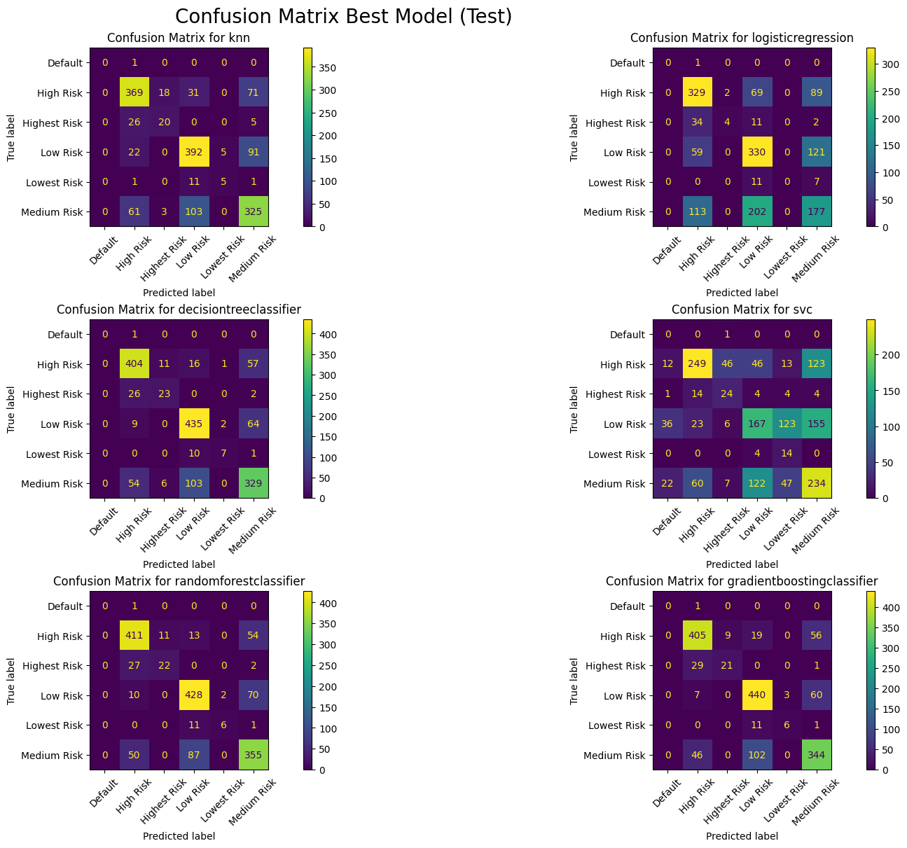

### Project Title
Predicting Corporate Credit Ratings Using Machine Learning

**Author**
Nagendra D

#### Executive summary
This project develops and compares machine learning models to predict corporate credit ratings using financial ratios. The analysis employs four different classifiers (KNN, Logistic Regression, Decision Tree, and SVM) and identifies the most influential financial indicators for credit rating prediction. Through hyperparameter tuning and feature importance analysis, we provide insights into the key factors that determine a company's credit rating.

#### Rationale
Credit ratings play a crucial role in financial markets, influencing borrowing costs and investment decisions. Understanding how financial ratios impact credit ratings can help:
- Companies improve their financial metrics to achieve better ratings
- Investors make informed decisions about corporate bonds
- Financial institutions assess credit risk more effectively
- Regulators monitor financial system stability

#### Research Question
1. Which machine learning model best predicts corporate credit ratings using financial ratios?
2. What are the most important financial indicators that influence credit ratings?

#### Data Sources
- Dataset: [Corporate Credit Rating with Financial Ratios](https://www.kaggle.com/datasets/kirtandelwadia/corporate-credit-rating-with-financial-ratios/data) 
- Source: Kaggle dataset
- Size: 7,805 observations with 25 features
- Features: Financial ratios and credit ratings from major rating agencies. [Full Data Description](./predict_credit_rating.ipynb#dataset-features)
- Citation: Makwana, R., Bhatt, D., Delwadia, K. et al. Understanding and Attaining an Investment Grade Rating in the Age of Explainable AI. Comput Econ 66, 105–126 (2025). https://doi.org/10.1007/s10614-024-10700-7

#### Methodology
1. **Exploratory Data Analysis**
   - Performed missing data analysis to identify features with missing data
   - Visualized data distributions and performed outlier analysis
   - Performed target variable distribution analysis
   - Verified the correlation between features

2. **Data Preprocessing**
   - Grouped ratings into risk categories (Lowest Risk, Low Risk, Medium Risk, High Risk, Highest Risk, Default) to reduce target categories
   - Standardized numerical features to reduce the influence of outliers

3. **Model Development**
   - Implemented four classifiers:
     - K-Nearest Neighbors (KNN)
     - Logistic Regression
     - Decision Tree
     - Support Vector Machine (SVM)
   - Used GridSearchCV for hyperparameter tuning
   - Evaluated models using accuracy, classification reports, and confusion matrices
   
4. **Evaluation Metrics**
   - In Credit Risk prediction models, 
     - For High Risk classes (High Risk, Highest Risk, Default) : High recall is usually more critical as missing a default can be extremely costly. Few false positives can be tolerable.
     - For Low Risk classes (Lowest Risk, Low Risk): High precision is more important as incorrectly labeling a safe company as risky would result in lost opportunity for investors and restrict access to capital for companies.
     - For Medium Risk classes (Medium Risk) : Balancing of precision and recall is desirable. 

#### Results
1. **Exploratory Data Analysis**
   - Dataset contains 7,805 corporate credit ratings with no missing values

   1. **Data Distribution Analysis**
      - Most financial ratios show non-normal distributions with significant skewness
      - Plot below Shows the distribution of financial ratios across the dataset
      
   
   2. **Credit Rating Distribution**
      - The dataset shows an uneven distribution across risk categories:
         - Medium Risk: Largest segment (BBB+, BBB, BBB-)
         - High Risk: Second largest (BB+, BB, BB-, B+, B, B-)
         - Low Risk: Third largest (A+, A, A-)
         - Highest Risk: Smallest segment (CCC+, CCC, CCC-, CC)
         - Default: (D)
         
         

   3. **Outlier Analysis**
      - Computed outlier percentages using the IQR method and identified features with the highest proportion of outliers. The bar chart below shows the percentage of outliers detected per numerical feature (IQR rule — values outside [Q1 - 1.5*IQR, Q3 + 1.5*IQR]).
         

      - Features with >10% outliers:

        | Feature                         | % outliers |
        |---------------------------------|------------|
        | Return On Tangible Equity       | 15.08%     |
        | Debt/Equity Ratio               | 12.68%     |
        | ROE - Return On Equity          | 12.57%     |
        | Free Cash Flow Per Share        | 12.24%     |
        | Operating Cash Flow Per Share   | 11.48%     |

      - Also examined whether outliers cluster in rows. There are 4,079 rows with at least one outlier. The distribution of the number of outlier features per row is shown below.
         

      These results suggest outliers are common in several financial ratios so we must consider robust scaling during preprocessing.

   4. **Correlation Analysis**
      - There is strong positive correlation between various features
      

      - Highly Correlated Features (likely redundant)

         | Feature 1               | Feature 2              | Correlation |
         |-------------------------|------------------------|-------------|
         | Operating Margin        | EBIT Margin            | 0.9997      |
         | Pre-Tax Profit Margin   | Net Profit Margin      | 0.96515     |
         | EBIT Margin             | EBITDA Margin          | 0.921193    |
         | Operating Margin        | EBITDA Margin          | 0.920759    |
         | Operating Margin        | Pre-Tax Profit Margin  | 0.916338    |
         | EBIT Margin             | Pre-Tax Profit Margin  | 0.916165    |
         | Operating Margin        | Net Profit Margin      | 0.879209    |
         | EBIT Margin             | Net Profit Margin      | 0.879104    |
         | EBITDA Margin           | Pre-Tax Profit Margin  | 0.81917     |
         | Pre-Tax Profit Margin   | ROA - Return On Assets | 0.797267    |
         | Net Profit Margin       | ROA - Return On Assets | 0.787621    |
         | EBITDA Margin           | Net Profit Margin      | 0.767419    |
         | Operating Margin        | ROA - Return On Assets | 0.754847    |
         | EBIT Margin             | ROA - Return On Assets | 0.754676    |

2. **Preprocess Data**
   - Removed 'Rating Agency', 'Corporation', 'Rating Date', 'CIK', 'Binary Rating', 'SIC Code', 'Sector' and 'Ticker' as they do not contribute to Rating of a company
   - Grouped ratings into risk categories for more robust classification (Reference - https://www.investopedia.com/terms/c/corporate-credit-rating.asp)
    
      | Risk Category | Rating                      |
      |---------------|-----------------------------|
      | Lowest Risk   | AAA                         | 
      | Low Risk      | AA+, AA, AA-, A+, A, A-     |
      | Medium Risk   | BBB+, BBB, BBB-             |
      | High Risk     | BB+, BB, BB-, B+, B, B-     |
      | Highest Risk  | CCC+, CCC, CCC-, CC+, CC, C |
      | Default       | D                           |
         
      

3. **Model Performance**
   
   - Best performing model: Decision Tree
   - Test Accuracy: 88.85%
   - Training Time: 0.18 seconds

4. **Feature Importance**
   Top influential features for credit rating prediction:
   - Pre-Tax Profit Margin
   - Long-term Debt / Capital
   - Current Ratio
   - Gross Margin
   - Asset Turnover
    
   

#### Next steps
1. **Model Improvement**
   - Explore ensemble methods (Random Forest, XGBoost)
   - Implement deep learning approaches

2. **Feature Engineering**
   - Develop industry-specific features
   - Include macroeconomic indicators

3. **Business Applications**
   - Develop a web interface for rating predictions
   - Create monitoring system for rating changes
   - Design early warning system for rating downgrades

#### Outline of project
1. Getting Started
   - [Libraries and Dependencies](predict_credit_rating.ipynb#import-required-libraries)
   - [Data Loading and Dataset Features](predict_credit_rating.ipynb#load-and-inspect-the-data)

2. Exploratory Data Analysis
   - [Missing Values Analysis](predict_credit_rating.ipynb#missing-values-analysis)
   - [Summary Statistics](predict_credit_rating.ipynb#summary-statistics)
   - [Data Distribution Analysis](predict_credit_rating.ipynb#data-distribution-analysis)
   - [Outlier Analysis](predict_credit_rating.ipynb#outlier-analysis)
   - [Correlation Analysis](predict_credit_rating.ipynb#correlation-analysis)

3. Data Preprocessing
   - [Feature Selection](predict_credit_rating.ipynb#preprocess-data)
   - [Target Variable Grouping](predict_credit_rating.ipynb#preprocess-data)
   - [Train/Test Split](predict_credit_rating.ipynb#traintest-split)

4. Model Development and Evaluation
   - [Baseline Model (Logistic Regression)](predict_credit_rating.ipynb#baseline-model-with-logistic-regression)
   - [Model Training and Comparison](predict_credit_rating.ipynb#train-and-evaluate-knn-logistic-regression-decision-tree-and-svm)
   - [Hyperparameter Tuning](predict_credit_rating.ipynb#hyperparameter-tuning-with-gridsearchcv)

5. Results Analysis
   - [Model Performance Comparison](predict_credit_rating.ipynb#train-and-evaluate-knn-logistic-regression-decision-tree-and-svm)
   - [Feature Importance Analysis](predict_credit_rating.ipynb#feature-importance-analysis-for-the-best-model)
   - [Confusion Matrices](predict_credit_rating.ipynb#train-and-evaluate-knn-logistic-regression-decision-tree-and-svm)

##### Contact and Further Information
Nagendra D
- GitHub: https://github.com/master-coder-1